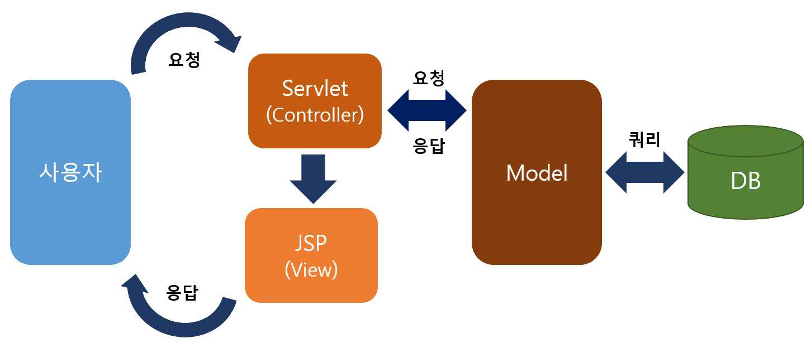

<!-- # java-springboot-2025
2025년 java 개발자 과정 springboot 리포지토리

## 1일차(04/01)

### 웹 개요
- 구성 3단계
    - 브라우저(클라이언트/프론트엔드) - 사용자가 **요청**을 하고, 결과를 돌려받는 파트
    - 서버(백엔드) - 사용자의 요청을 받아서 DB에서 데이터를 가져와 처리하고, 사용자에게 응답하는 파트
    - 데이터베이스 - 가장 중요한 데이터가 저장되어 있는 파트
- 웹 개념
    - Request(요청)에 대한 Response(응답) (cf.웹이 뭐에요? 사용자 요청에 대한 응답입니다)
### SpringBoot 개요
- Java - 컴퓨팅 세상 모든 곳에서 사용될 수 있는 언어가 되고자 개발됨
- 웹개발
    1. CGI(Common GateWay Interface) - HTTP 프로토콜에서 정적인 데이터만 전달할 수 있는 웹기술
    2. Servlet - CGI 를 개선한 JAVA 웹 기술
        - HTML 코드를 전부 다 Java 에서 작성해야 함
    3. EJB(EnterPrise Java Bean) - 서블릿으로 대형 프로젝트를 개발할 수 있는 Java 웹기술
        - 무지 복잡
    4. JSP(Java Server Page) - 웹페이지 코드(HTML)에 자바소스를 포함시켜서 개발할 수 있는 Java 웹기술
        - 확장자가 .jsp / 스파게티 코드
    5. Spring - Java 웹개발에 전성기. 웹페이지와 자바영역 분리
        - 설정이 복잡
    6. Spring Boot - Spring 의 단점을 최소화. 설정을 간결과

- Spring Boot
    - https://spring.io/projects/spring-boot
    - Spring 기술을 그대로 사용(마이그레이션이 간단)
    - JPA 기술을 사용하면 ERD 나 DB 설계를 하지 않고도 손쉽게 DB 를 생성
    - Tomcat Webserver 가 내장(설치할 필요 없음)
    - 서포트하는 기능 다수 존재(개발을 쉽게 도와줌)
    - 테스트용 JUnit, 로그용 Log4J2 모두 포함(설치 필요 없음)
    - 프론트엔드를 다양하게 지원. JSP, **Thymeleaf**, Mustache 등
    - MVC(Model View Controller) 로 영역을 분리. 각 부분별로 따로 개발

- MVC
    - View 는 JSP 포함, Thymeleaf, Mustache, HTML 등등
    

### Spring Boot 개발환경 설정
- 필수요소
    - Java, 개발툴, 데이터베이스

- Java
    - Java Runtime 과 JDK(Java Deveploer Kit) 존재
        - Oracle 외에도 OpenJDK가 산재
        - https://www.azul.com/downloads/?package=jdk#zulu
        - https://adoptium.net/
        - https://jdk.java.net/
    - Java 17버전 이상 설치
    - https://www.oracle.com/kr/java/technologies/downloads/
    - 

    - 시스템정보(sysdm.cpl) 고급 > 환경변수 PATH 설정
        - 새로만들기
            - JAVA_HOME - 본인결로 입력
        - path에 %JAVA_HOME%\bin 추가, 맨 위로
    - powershell
        - java --version 으로 확인

- Visual Studio Code 확장 설치
    - Java 검색
        - Extension Pack for Java 설치. Debugger for Java 등 총 7가지 확장 설치

### Java 기본 실행
- VS Code 에서 명령팔레트 실행(Ctrl + shift+ p)
    - Java create
        1. build tool > Maven
        2. No ArchType 선택
        3. Group ID 입력(com.example(example 대신 이니셜))
        4. Artifact ID 입력(demo(대신 hello 입력함))
        5. 저장위치 결정

### Spring Boot 설정
- Visual Studio Code 확장 설치
    - Spring 검색
        - Spring Boot Extension Pack 설치(추가 3개 확장 같이 설치됨)
    - Gradle(build tool) 검색
        - Gradle for Java 설치

### Spring Boot 기본 실행(Java 프로젝트)
- VS Code 에서 명령 팔레트 실행


- 실행방법
    - 코드 작성
    - Spring Boot DashBoard > Apps > 앱 실행

- 기초문법
    - [JAVA기초문법](./JAVA_BASIC.md) -->

# java-springboot-2025
2025년 부경대 Java개발자 과정 SpringBoot 리포지토리

## 1일차(04-01)

### 웹 개요
- 구성 3단계
    - 브라우저(클라이언트/프론트엔드) - 사용자 **요청**을 하고, 결과를 돌려받는 파트
    - 서버(백엔드) - 사용자의 요청을 받아서 DB에서 데이터를 가져와 처리하고, 사용자에게 **응답**하는 파트
    - 데이터베이스 - 가장 중요한 데이터가 저장되어 있는 파트
- 웹 개념
    - 사용자 Request(요청)에 대한 서버의 Response(응답)

### Spring Boot 개요
- Java - 컴퓨팅 세상 모든곳에서 사용될 수 있는 언어가 되고자 개발됨
- Java 웹개발
    1. CGI(Common GateWay Interface) - HTTP 프로토콜에서 정적인 데이터만 전달할 수 있는 웹기술
    2. Servlet - CGI를 개선한 Java 웹기술. 동적웹을 개발할 수 있음
        - HTML코드를 전부다 Java에서 작성해야 함
    3. EJB(Enterprise Java Bean) - 서블릿으로 대형 프로젝트를 개발할 수 있는 Java 웹기술
        - 무지하게 복잡!        
    4. JSP(Java Server Page) - 웹페이지코드(HTML)에 자바소스를 포함시켜서 개발할 수 있는 Java 웹기술
        - 확장자가 .jsp / 스파게티 코드
    5. Spring - Java 웹개발에 전성기. 웹페이지와 자바영역 분리
        - 대한민국 전자정부 웹프레임워크 기반
        - 설정이 복잡
    6. Spring Boot - Spring의 단점을 최소화. 설정을 간결화

- Spring Boot
    - https://spring.io/projects/spring-boot
    - Spring 기술을 그대로 사용(마이그레이션이 간단)
    - JPA 기술을 사용하면 ERD나 DB설계를 하지 않고도 손쉽게 DB를 생성. DB연동도 쉬움
    - Tomcat Webserver가 내장!(설치 필요없음)
    - 서포트하는 기능 다수 존재(개발을 쉽게 도와줌)
    - 테스트용 JUnit, 로그용 Log4J2 모두 포함(설치 필요없음)
    - 프론트엔드를 다양하게 지원. JSP, **Thymeleaf**, Mustache 등
    - React, View.js 등의 자바스크립트 프론트엔드와 연계해서 풀스택 개발 가능
    - MVC(Model, View, Controller)로 영역을 분리. 각 부분별로 따로 개발

- MVC
    - View는 JSP포함, Thymeleaf, Mustach, HTML 등등 

    

### Spring Boot 개발환경 설정
- 필요요소
    - Java, 개발툴, 데이터베이스

- Java 
    - Java Runtime과 JDK(Java Developer Kit) 존재
        - Oracle 외에도 OpenJDK가 산재
        - https://www.azul.com/downloads/?package=jdk#zulu
        - https://adoptium.net/
        - https://jdk.java.net/ 
    - Java 17버전 이상설치
    - https://www.oracle.com/kr/java/technologies/downloads/
    - jdk-17.0.13_windows-x64_bin.msi 다운로드 

    - 시스템정보(sysdm.cpl) 고급>환경변수 PATH 설정
        - 새로만들기 
            - JAVA_HOME - 본인경로 입력
        - path에 %JAVA_HOME%\bin 추가, 맨 위로 
    - powershell
        - java --version 으로 확인

- Visual Studio Code 확장 설치
    - Java 검색
        - Extension Pack for Java 설치. Debugger for Java등 총 7가지 확장 설치

### Java 기본 실행
- VS Code에서 명령팔레트 실행(Ctrl+Shift+p)
    - Java create
        1. build tool > Maven
        2. No ArchType 선택
        3. Group ID 입력(com.example)
        4. Artifact ID 입력(demo)
        5. 저장위치 결정

### Spring Boot 설정
- Visual Studio Code 확장 설치
    - Spring 검색
        - Spring Boot Extension Pack 설치(추가 3개 확장 같이 설치됨)
    - Gradle(빌드툴) 검색
        - Gradle for Java 설치

### Spring Boot 기본 실행(Java 프로젝트)
- VS Code에서 명령팔레드 실행
    - Spring Initializr: Create a Maven Project
    - Specify Spring Boot version: 3.3.10
    - Specify project language: Java
    - Input Group Id: com.hugo83(각자 설정할 것)
    - Input Artifact Id: spring01
    - Specify packaging type: Jar(Java archive, 압축파일)
    - Specify Java version: 17
    - Choose dependencies: Selected 0 dependencies
    - 저장위치 선택
    - **새 창 열기** - Spring Boot 프로젝트가 루트폴더가 된 개발환경

- 실행방법
    - 코드 작성
    - Spring Boot Dashboard > Apps > 앱 또는 Ctrl+F5

- 기초문법
    - [JAVA기초문법](./JAVA_BASIC.md)
    - 기본, 변수, 자료형, 연산자, 흐름제어어


## 2일차
- 기초문법 계속
    - [JAVA기초문법](./JAVA_BASIC.md)
    - 흐름제어(반복문), 배열, 메서드, 객체/클래스, 상속

## 3일차
- 기초문법 계속
    - [JAVA기초문법](./JAVA_BASIC.md)
    - 상속, 인터페이스, 예외처리, 제네릭, 컬렉션 프레임워크, 입출력

### Spring Boot Build Tool
- 개요
    - 프로젝트 빌드 과정을 자동화시켜주는 도구
    - 컴파일, 테스트, 패키징, 의존성 관리, 배포 등등 포함

- Maven
    1. Java 프로젝트 기본 빌드도구
    2. Maven Repository https://mvnrepository.com/ 검색가능
    3. 빌드, 패키징(jar/war 파일 생성), 테스트 등을 한번의 명령으로 간편하게 처리
    4. 가장 큰 특징이 외부 라이브러리 자동으로 다운로드, 관리
    5. pom.xml(Project Object Model) 파일로 빌드 설정 관리
        - 초기 설정 시 빠졌거나, 추가되어야 하면 xml 코딩으로 추가
    6. VS Code 확장 중 Maven Dependency Explorer 등으로 확인

- Gradle
    1. 안드로이드용 오픈소스 빌드도구
    2. Maven Repository를 같이 사용
    3. Maven의 3, 4번 특징을 그대로 가지고 있음
    4. build.gradle 파일 사용. Groovy 스크립트 지원
    5. 빌드과정을 병렬처리, 캐싱사용으로 Maven보다 10 ~ 100배 향상된 성능 구현현 

### Gradle 설정
- Gradle로 프로젝트가 제대로 동작하지 않으면
    - https://gradle.org/ 에서 gradle 다운로드
    - 설치 경로 확인, 설치
    - 시스템 등록정보 PATH 지정. GRADLE_HOME 사용용

### Spring Boot 로그 설정
- Spring Boot를 colorizing 해주는 기능
- src/resources/application.properties

    ```shell
    spring.output.ansi.enabled=always
    ```
- 서버 재시작

## 4일차
- 기초문법 마무리
    - [JAVA기초문법](./JAVA_BASIC.md)
    - 제네릭, 컬렉션, 프레임워크, 입출력, 람다식, 스트림API
- Spring Boot 시작
- Gradle 오류 해결 방법
## 5일차

## 6일차(06/26)

